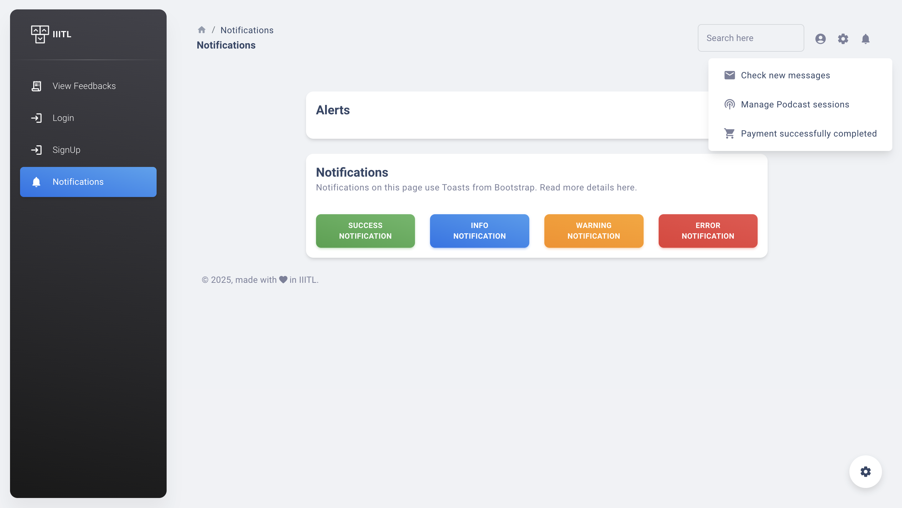
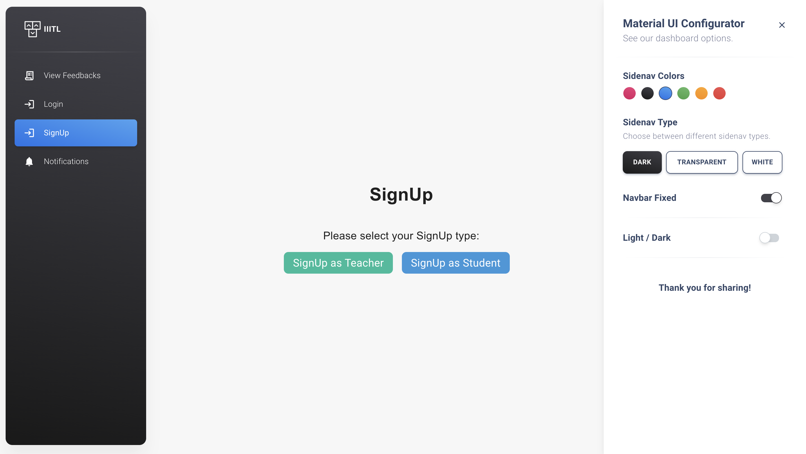
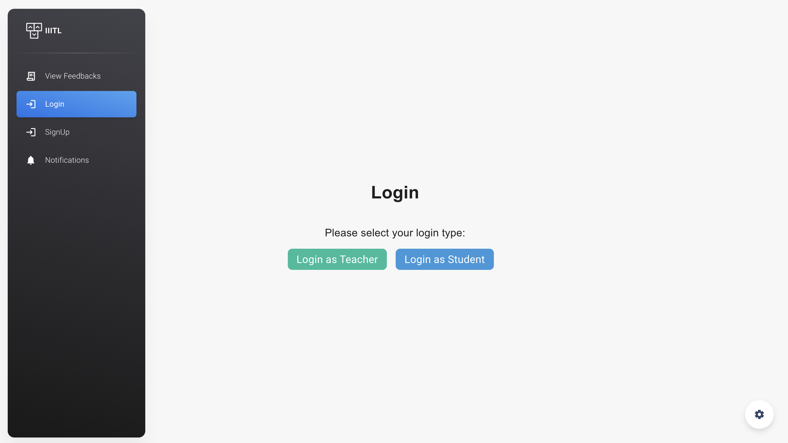
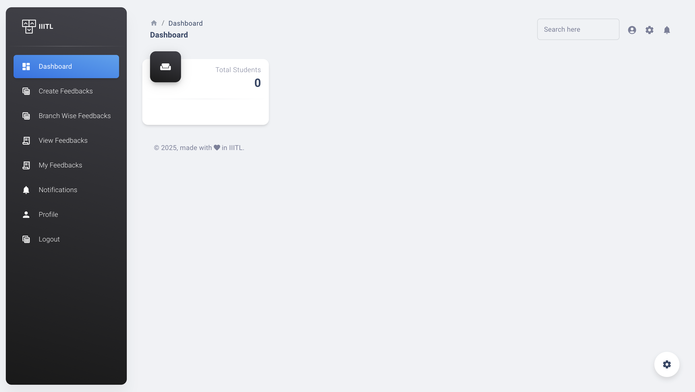
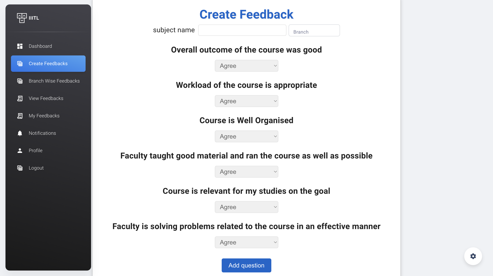
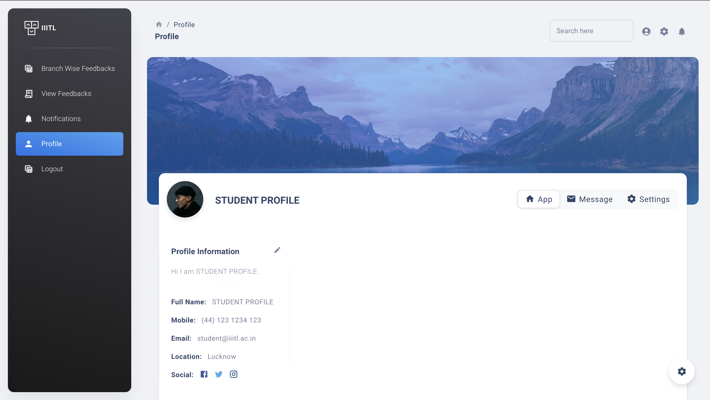
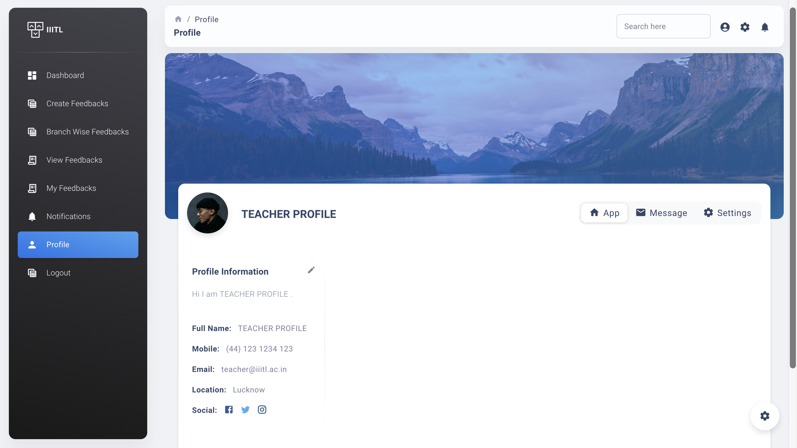

# 📚 Student Feedback Portal
A **full-stack web application** for managing and collecting feedback from students and teachers.  
Built with **React**, **Node.js**, **Express**, **MongoDB**, and **Material UI** for a responsive, modern, and user-friendly experience.

## 🚀 Features
- Role-based access: Teacher & Student accounts
- Authentication for login & signup
- Create and submit feedback forms
- View all feedback; filter by branch
- Profile pages for teachers & students
- Charts for feedback insights
- Responsive UI (desktop & mobile)
- Hugging Face API integration (for NLP/ML features)

## 📸 Screenshots
| Notifications | Signup Page | Login Page |
|---|---|---|
|  |  |  |

| Teacher Dashboard | Create Feedback | Student Profile |
|---|---|---|
|  |  |  |

| Teacher Profile |
|---|
|  |

## 🛠 Tech Stack
**Frontend**
- React 17
- Material UI (MUI)
- Chart.js + react-chartjs-2
- React Router DOM v6
- Yup (form validation)
- Chroma.js
- React Table

**Backend**
- Node.js, Express.js
- MongoDB + Mongoose
- dotenv, cors, morgan
- node-fetch, path
- (Auth for login & signup)
- Hugging Face integration from backend

**Development**
- nodemon
- ESLint & Prettier

## ⚙️ Installation & Setup
```bash
# 1) Clone the repository
git clone https://github.com/mahammadctr/Student-Feedback-Portal.git
cd Student-Feedback-Portal

# 2) Backend setup
cd backend
npm install

# Create .env in backend (replace with your real values)
echo 'MONGODB_URL="your-mongodb-connection-string"
HF_TOKEN="your-huggingface-token"
PORT=3005' > .env

# Start backend
npm start

# 3) Frontend setup
cd ../frontend
npm install
npm start

```

## 🔐 Environment Variables

| Variable      | Description                         |
| ------------- | ----------------------------------- |
| `MONGODB_URL` | MongoDB connection string           |
| `HF_TOKEN`    | Hugging Face API token              |
| `PORT`        | Backend server port (default: 3005) |

## 📬 API Endpoints (examples)

| Method | Endpoint            | Description              |
| ------ | ------------------- | ------------------------ |
| POST   | `/auth/signup`      | Register a new user      |
| POST   | `/auth/login`       | User login               |
| GET    | `/feedback`         | Get all feedback         |
| POST   | `/feedback`         | Create new feedback      |
| GET    | `/feedback/:branch` | Get branch-wise feedback |

## 🗂 Architecture

```text
Frontend (React + MUI) → Router/Forms → Axios/fetch → Backend (Express) → Mongoose → MongoDB
External integration: Backend ↔ Hugging Face API
```

## 📜 License

This project is licensed under the **MIT License**.

## 🙏 Acknowledgements

* [Material UI](https://mui.com)
* [Chart.js](https://www.chartjs.org)
* [Hugging Face](https://huggingface.co)
* [MongoDB](https://www.mongodb.com)

```
```

